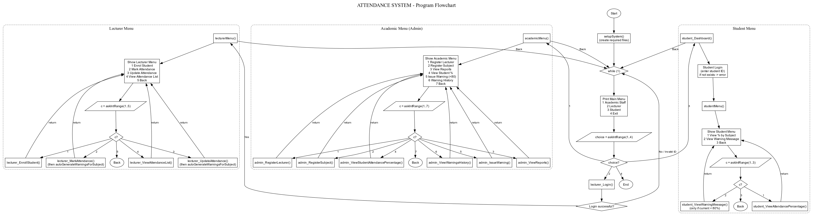

  


A console application written in C that handles university attendance for three kinds of users: academic staff, lecturers and students. Data is stored in plain text files, so there is no database to set up.

It replaces paper registers and scattered spreadsheets with one program that records attendance, calculates percentages and warns students who fall below 80%.



## Features

**Academic staff**
- Register lecturers and subjects, and link each subject to a lecturer
- View attendance reports by subject or by lecturer
- View a student's attendance percentage across all their subjects
- Issue manual warnings to students below 80%, with a custom message and date
- View the full warning history

**Lecturers**
- Log in with a lecturer ID
- Enrol students into subjects they teach
- Record daily attendance (present/absent) for a subject
- Update an existing attendance record
- View the attendance list for any date, with "Not Recorded" shown for gaps

**Students**
- Log in with a student ID
- View attendance percentage per subject
- View warning messages, shown only while their current attendance is still below 80%

## How it works

- **Automatic warnings:** every time a lecturer records or updates attendance, the program recalculates each enrolled student's percentage and writes an AUTO warning for anyone below 80%. It checks for an existing AUTO warning first, so the same student and subject never get duplicates.
- **Manual warnings:** academic staff can issue their own warnings, stored with the type MANUAL.
- **Permissions:** a lecturer can only enrol students and mark attendance for subjects assigned to them. Students can only see their own data, and the student side is read-only.
- **Validation:** duplicate lecturers, subjects, enrolments and attendance records for the same student, subject and date are rejected. Menu input is range-checked, and missing files are handled without crashing.
- **Updating a record:** a text file cannot be edited in place, so the update function copies every line to a temporary file, changes the target record, then replaces the original file.

## Data files

Created automatically on first run, in the folder you run the program from. Fields are separated by `|`.

| File | Contents |
|---|---|
| `lecturers.txt` | lecturer ID, name |
| `subjects.txt` | subject code, name, lecturer ID |
| `students.txt` | student ID, name |
| `enrollments.txt` | student ID, subject code |
| `attendance.txt` | student ID, subject code, date, status (1 present, 0 absent) |
| `warnings.txt` | student ID, subject code, percentage, date, type (AUTO or MANUAL), message |

## Build and run

You need a C compiler such as GCC.

```bash
git clone https://github.com/mohammedadalachi/attendance-management-system-c.git
cd attendance-management-system-c
gcc -Wall -Wextra -o attendance_system attendance_system.c
./attendance_system          # Windows: attendance_system.exe
```

A sensible first session:

1. Choose **Academic Staff**, register a lecturer, then register a subject for that lecturer.
2. Choose **Lecturer**, log in with that lecturer ID, then enrol a student and record attendance.
3. Choose **Student**, log in with the student ID and view the percentage and any warnings.

Dates are entered as `YYYY-MM-DD`.

## Project structure

```
attendance_system.c     the whole program
docs/flowchart.png      program flowchart
```

## Limitations

- Text files only, so it is not suited to large numbers of records
- Login uses an ID only, with no passwords
- All code is in one source file
- Dates are entered by hand and checked only lightly
- A warning is written once per student and subject, so it will not update if attendance drops further

## Ideas for improvement

- Passwords and role-based accounts
- Split the code into modules with header files
- Replace the text files with SQLite
- Export reports to CSV
- Stronger date validation

## Author

Dalachi Mohammed Abderrahmane ([@mohammedadalachi](https://github.com/mohammedadalachi))

Developed as a university project for AIT101 Programming Language C.

## License

MIT. See [LICENSE](LICENSE).
